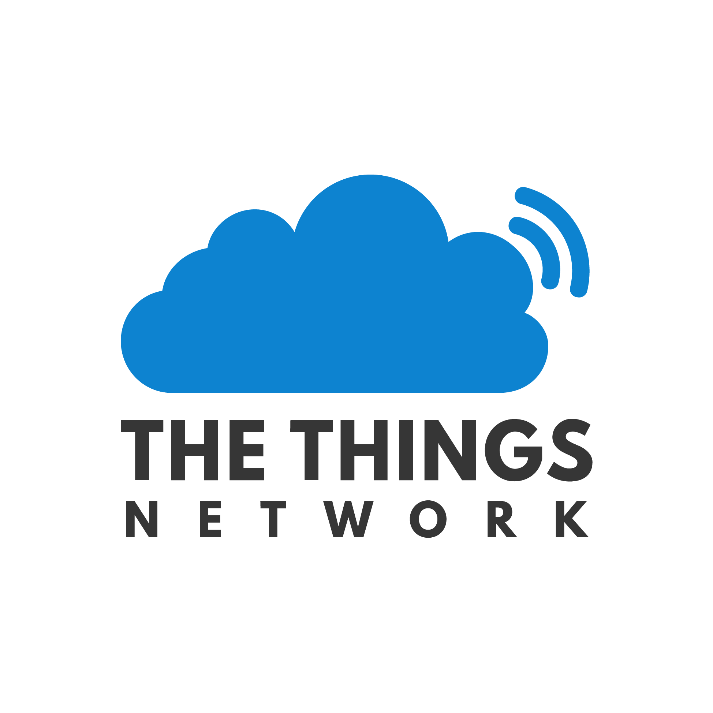
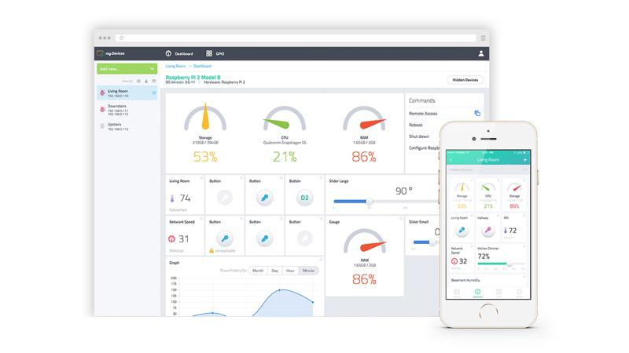
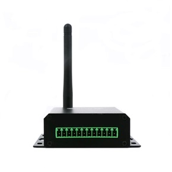
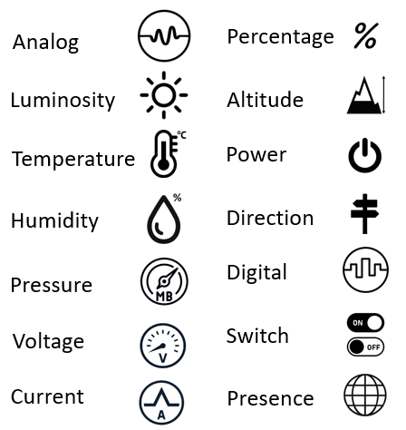
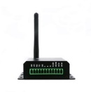

{width="2.1in" height="1.4854166666666666in"}

{width="2.6in" height="1.788888888888889in"}

{width="2.4743055555555555in"
height="2.7916666666666665in"}

{width="1.9583333333333333in"
height="2.0722222222222224in"}

{width="1.3263888888888888in"
height="0.4222222222222222in"}

{width="0.5916666666666667in"
height="0.4618055555555556in"}

**DAQ**, Kolaylıkla **IoT (Nesnelerin İnterneti)** projelerinizi
yapabileceğiniz, LoRaWAN kablosuz ağlarıyla uyumlu bir **sensör
aktarıcısıdır**. Üzerindeki **Analog ve Dijital** girişlerine çok
çeşitli sensörleri bağlayabilir, **kilometrelerce** mesafelerden
**kablosuz** yolla bilgi toplayabilirsiniz.

Endüstride mevcut **makineleri** **IoT uyumlu** hale
dönüştürebilirsiniz.

**Akıllı Şehir, Kampüs, Endüstri, Tarım, Otel** ve benzer IoT projenizin
merkezinde **internete** bağlanmış olan bir **LoRaWAN Gateway** cihazı
bulunur. Projenizdeki çok sayıda **DAQ** ünitelerinizden gelen veriler
buradan paketlenerek internete servis edilir. Kendinize ait veya **Açık
kullanım** özelliğindeki diğer kurulu olan LoRaWAN Gateway
cihazlarındanve istasyonlardan faydalanabilirsiniz.

**DAQ** üniteleri, baştan-sona, **The Things Network (TTN)** ve
**myDevices Cayenne** adlı **ücretsiz**

**veri görüntüleme uygulaması** ile tam uyumludur. Uygulamayı indirip
kurduğunuz **PC** ve **Mobil** cihazlarınızda, ünitelerinizden gelen
verileri **zengin görsellerden** takip edebilir, **geçmiş verilere**
erişebilir, **alarm ve uyarıları** bekleyebilirsiniz. Diğer platformlara
kolayca yönlendirebilirsiniz.

LoRaWAN standardı, **ISM** bantlarında, mevcut WiFi, ZigBee, FSK
standartlarına göre daha düşük güçle ve uzak mesafelerde çalışan
kablosuz sensörlerin yapımını mümkün kılar. IP tabanlı olmayıp; **cihaz
kimliği**, uygulama kimliği ve kripto güvenlik anahtarı ile sensörlerin
**IoT platformlarında** takibi için beklenen **esnekliğe ve güvenliğe**
sahiptir.

IoT projeleriniz için **DAQ** ünitelerini, Gateway cihazını ve çeşitli
Analog ve Dijital sensörleri
[[www.example.com]{.ul}](http://www.example.com/) web mağzamızdan satın
alabilirsiniz.

Ürünlerin başlangıç ayarları yapılmış olup **Tak-Çalıştır** özelliği ile
kullanıma hazırdır.

**( Türkiye EU868 MHz )**

**ÖZELLİKLER**

**2 Kanal Analog sensör girişi**

4-20ma endüstriyel otomasyon standardı

Diferansiyel, 16 bit çözünürlük

High ve Low taraf ölçüm yapabilme

Düşük ölçüm direnci, 50 Ohm (Max. 1V gerilim düşümü)

Giriş ölçeklendirme

Sıcaklık, nem, basınç, pozisyon vb. 14 farklı birim tanımlama

Yüksek ve düşük alarm seviyeleri ve kalma süreli histeresis

Aşırı voltaj ve elektrostatik koruma

**2 Kanal Dijital sinyal girişi**

3-24V High seviye

3 farklı dijital birim tanımlama

Dijital alarm ve kalma süreli histeresis

Optoelektronik izolasyon

**5-24V DC endüstriyel besleme girişi**

Dahili 3.3V DC-DC buck dönüştürücü

Alıcı 60mW, Verici 360mW(anlık) güç tüketimi

**Endüstriyel ortama uygun fiziksel tasarım**

Geçmeli tip vidalı klemens girişi

USB micro B konnektör

Aksiyon ledi

Reset butonu

3dbi harici anten

Montaj kulaklı, boyalı alüminyum kutu

24(h)x60(w)x70(l) mm

**Kolay kurulum**

Tak-Çalıştır özelliği, TTN (The Things Network) ve myDevices Cayenne

USB ile PC ve mobil cihazdan parametre ayarlama imkanı

Rapor süresi, alarm seviyeleri, cihaz kimliği, kablosuz çalışma
parametreleri ve diğerleri

**LoRaWAN kablosuz ağ**

LoRaWAN Class A

Lisans gerektirmeyen ISM Bant (EU868, US915, AU915, AS923, IN865, KR920)

20dbm (100mW) radyo verici çıkış gücü

-148dbm radyo alıcı hassasiyeti

Şehir içi 3Km, Şehir dışı 15Km'ye kadar çalışma mesafesi

DevEUI, AppEUI, AppKEY ile OTAA aktivasyonu
